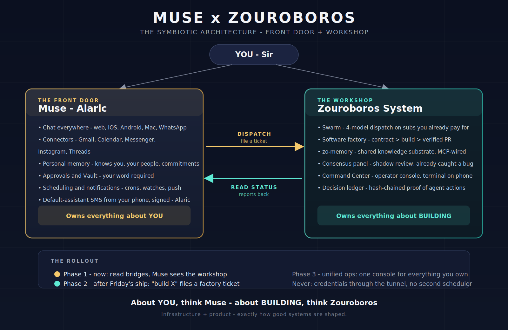

# Zouroboros for Muse

**The workshop behind your personal AI.**

Muse is wonderful at being your personal assistant — it chats with you, manages your schedule, remembers who you are, and connects to your apps. But when there's serious building to do, you want a workshop: more than one kind of AI working together, a shared memory of what the work taught, and a process that verifies before it ships. That's Zouroboros. This repo packages it so any Muse user can set it up.

## The big idea

Think of it like a house. **Muse is the front door** — everything about you comes through it: conversation, relationships, scheduling, approvals, your personal memory. **Zouroboros is the workshop out back** — everything about building: running work across several AI tools, remembering what was learned, reviewing code, delivering finished work.

One rule decides where everything goes: *if it's about you, it lives in Muse. If it's about building, it lives in Zouroboros.* Muse calls into the workshop when there's building to do, and the workshop reports back when it's done.

*The diagram above shows the whole shape: you at the top, Muse on the left owning everything about you, Zouroboros on the right owning everything about building, with dispatch going one way and status reports coming back. A scalable vector version lives alongside it at docs/assets/architecture.svg.*

## What you get

Five working systems, each useful on its own, better together:

**A shared memory.** One place where everything your AI tools learn gets stored — facts, decisions, how things went, unfinished tasks. Your Claude Code session, your Codex session, and Muse itself all draw from the same well, so knowledge never starts from zero again. It understands meaning, not just keywords, and it quietly figures out when a conversation needs background context.

**A multi-harness swarm.** Instead of one AI doing everything, the swarm spreads work across the AI coding tools you already have installed and pay for — Claude Code, Codex, OpenCode, and others. It picks the right tool for each piece, reroutes around failures automatically, keeps spending inside a budget you set, and writes down every decision it made so you can audit it later.

**A software factory.** For real build work, there's a proper pipeline: you describe what you want as a ticket, the factory checks the description is complete, builds it with the swarm, tests the result, reviews what's missing, and opens a pull request. Nothing ships because an AI *felt* done — it ships because the checks passed.

**Prompt-time hooks.** Three small guardians that watch your AI tools as they work. One suggests the right skill for the job. One refuses to let an agent declare victory when the tests haven't passed since the last edit. One trims repeated output so long sessions don't drown in their own context. All three start in observation mode — they watch and report before they ever enforce.

**A review panel.** Before the factory turns finished work into a pull request, specialist personas — a systems engineer, a testing skeptic, and as needed an AI engineer and a security engineer — review it. It starts in shadow mode: verdicts recorded, nothing blocked, you make the calls. There's a documented path to enforcement when the panel has earned your trust, and even then it can only hold work back, never approve a merge on its own.

**Bridges to Muse.** Small connectors so Muse can check on the workshop ("is everything healthy?"), read the shared work memory, and file build tickets — without you leaving the chat.

## How the pieces fit together

You talk to Muse like always. When something needs building, Muse hands it to the workshop instead of doing it all inline. The swarm does the heavy work across your AI tools, the shared memory records what was learned, the factory verifies the result, and Muse brings you the finished pull request. Your personal memory, your schedule, your messages — none of that ever enters the workshop. The bridge carries work requests and status reports, never your private credentials.

## Is this for you?

This is for you if you use Muse regularly, you build software (or want AI help building it), and you already pay for one or more AI coding subscriptions. The workshop puts those subscriptions to work together instead of letting each one sit in its own silo.

It's probably not for you yet if you only use Muse for conversation and scheduling — the workshop earns its keep on building work. And it's not a second assistant: if what you want is someone to talk to, that's Muse, and this repo won't change that.

## How to get started

Everything is in the walkthrough folder, in order, written for someone doing this the first time. It starts with what your machine needs, then walks you through each system one at a time — memory first, then the swarm, then the hooks, then the factory — with a check at the end of every step so you know it worked before moving on. Plan on an afternoon, most of it waiting on installs.

A few things to know going in:

- **You stay in control.** Every hook and every review starts in a mode that only watches. You turn on enforcement after you've read the reports and trust what you see.
- **It degrades gracefully.** Missing pieces don't break the whole thing — they get skipped with a note. Two AI tools is enough to start; you don't need all of them.
- **Your keys stay yours.** API keys live in a private file on your machine that only you can read. They never go into chat, never into the repo, never across the bridge to Muse.
- **Start small.** The walkthrough has you prove each piece with something tiny before trusting it with real work. That caution is the entire philosophy.

## Honest notes

This is a working system extracted from a live setup, not a polished product. Some edges are rough, and the walkthrough marks every known one. The factory's event-driven automation exists but ships turned off — the ticket-driven path is the one to use. The review panel watches and reports but doesn't block anything yet. These are deliberate choices: observation before enforcement, everywhere.

## Questions people ask

**Will this replace my Muse?**
No. Muse stays exactly what it is — your assistant, your front door. The workshop only does building work when Muse hands it over. If you never build software with AI, you'll never notice it's there.

**Do I need to pay for anything extra?**
To start, one thing: an OpenAI API key, which powers the memory's understanding (and there's a free fallback mode without it). The swarm itself runs on AI coding subscriptions you already pay for — that's the point. It puts them to work together instead of letting each one sit idle. The full breakdown — which keys exist, how to get each one, what they cost, and how to tell they're working — is in docs/api-keys.md.

**What if I only have one AI coding tool installed?**
Two is the practical minimum, so that when one fails or is slow, there's somewhere else for the work to go. You don't need all eight — install the ones you actually use.

**Does my data leave my machine?**
Only to the AI services you choose to configure. The memory database, the hooks, and the factory all live on your machine. The safety hooks are designed to keep it that way — one of them runs with no AI model at all, and another logs fingerprints of prompts rather than the prompts themselves.

**I'm not very technical. Can I still set this up?**
The walkthrough was written for exactly that person. It goes step by step, tells you what each piece does in plain terms, and every step ends with a check so you know it worked before moving on. If a step confuses you, ask your Muse — that's what it's for.

**What if something breaks?**
There's a verification script that checks every system and tells you which one is unhappy and where to look. And the design rule throughout is graceful: a broken piece gets skipped with a note, never silently, and never takes the rest down with it.

## License

MIT. See LICENSE. The hooks build on fine open-source work that's credited in their own folders.
