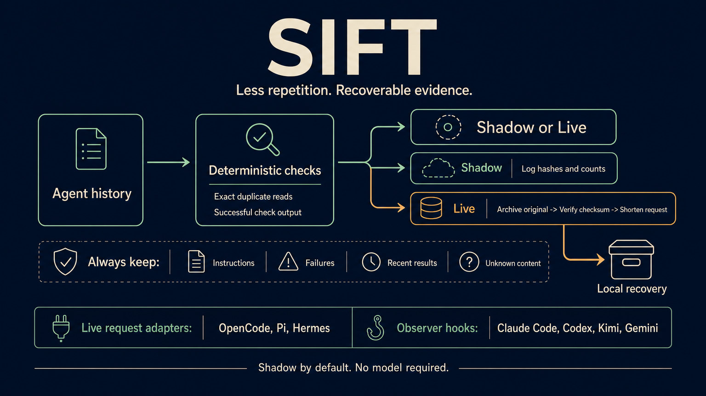

# Sift

**Less repetition. Recoverable evidence.**

Sift conservatively shortens repeated coding-agent tool output. It uses ordinary code, private local archives and a shared policy across seven harnesses. Start in shadow mode, inspect the evidence, then enable live request pruning where the harness exposes a supported interface.



## What it does

1. Match tool calls and results by their native IDs.
2. Protect instructions, ordinary user/assistant text, failures, unknown tools, ambiguous pairs, the first two messages and the latest eight messages.
3. Propose shortening an older read result only when the same tool, arguments and exact output recur later. Changed content does not qualify.
4. Propose shortening oversized output from an allowlisted check only when an explicit exit code is zero. Failed commands, masked pipelines and snapshot-update commands stay intact.
5. In live mode, store and verify the original output before inserting a recovery reference. Call IDs, arguments and result records stay in place.

**No Jev, FlashRank or LLM is required.** An optional, explicitly invoked reviewer can use your chosen model provider. It produces advice and never authorizes pruning. Ambiguous cases stay intact.

## Honest compatibility

| Harness | Installed consumer | Shadow behavior | Live request pruning |
| --- | --- | --- | --- |
| Claude Code | `PostToolUse`, `PostToolUseFailure`, `PreCompact` commands | Fingerprints; analyze available transcript at compaction | Not in this release |
| Codex CLI | `PostToolUse`, `PreCompact` commands | Fingerprints; analyze available transcript at compaction | Not exposed by its compaction hook |
| Kimi Code | `PostToolUse`, `PostToolUseFailure`, `PreCompact` commands | Tool fingerprints and boundary receipts | Not exposed by its compaction hook |
| Gemini CLI | `AfterTool`, `PreCompress` commands | Tool fingerprints and boundary receipts | Tool history omitted from its `BeforeModel` hook view |
| OpenCode | `experimental.chat.messages.transform` plugin | Analyze request without changing it | Supported |
| Pi | `context` extension | Analyze request without changing it | Supported |
| Hermes | `llm_request` middleware | Analyze request without changing it | Supported for Chat Completions and Responses messages |

All seven formats also support explicit analysis and export of compatible histories. Unknown layouts are retained; Sift never edits harness session databases. Gemini exports need native `parts` with tool IDs; its simplified hook `messages` are insufficient. Kimi JSON messages use OpenAI-style tool calls. This is format support, not a promise to decode every vendor's internal storage version.

The upstream Claude plugin uses experimental function hooks to replace compaction. Sift deliberately ships stable command-hook observation for Claude in this version. Supporting a harness does not mean it offers the same mutation surface as another harness.

Validated installed contracts: Claude Code 2.1.280, Codex 0.156.x, Kimi 0.41, Gemini 0.58, OpenCode 1.18.29, Pi 0.85 and Hermes 0.16. See [validation](docs/validation.md) for the evidence level of each integration.

## Install

Requirements: Python 3.11+, Bash, GNU `timeout`. Only the Hermes config installer needs PyYAML. Runtime pruning uses Python's standard library. Pi and OpenCode provide their own JavaScript runtime.

```bash
git clone git@github.com:marlandoj/sift.git
cd sift
python3 -m pip install -r requirements-install.txt
python3 scripts/install.py --project /absolute/project --dry-run
python3 scripts/install.py --project /absolute/project
python3 scripts/sift.py status
```

Select a subset with `--harness codex,pi,hermes`. Claude/Codex hooks apply to the selected project; other integrations are user-wide. The installer validates all selected config changes before writing, preserves unrelated settings, and backs up changed config bytes to `~/.sift/backups/`. Backups use a SHA-256 of the absolute config path plus its original bytes. Repeating the same install changes nothing and writes no backup. Existing mode choices are preserved.

Restart running harnesses after installation. Review the new Codex hooks using `/hooks`; Sift does not write trust hashes or bypass operator trust. Plugin links resolve to this checkout, so keep it at the installed location. The installer rejects conflicting plugin files rather than replacing them.

## Shadow, inspect, live

```bash
python3 scripts/sift.py report
python3 scripts/sift.py mode live --harness pi
python3 scripts/sift.py mode live --harness opencode
python3 scripts/sift.py mode live --harness hermes
python3 scripts/sift.py mode shadow
python3 scripts/sift.py off
python3 scripts/sift.py on
```

The CLI refuses unsupported live selections and requires selecting one harness for live mode. `SIFT_MODE=live` is available for an isolated invocation; it still cannot make an observer hook replace context. `SIFT=0` disables that invocation. Persistent mode changes take effect on the next request or hook event.

Live request pruning runs only on histories of at least 64,000 serialized bytes. Default output thresholds: duplicate reads at least 1,200 characters; successful check output at least 12,000 characters, preserving its first and last 400 characters around the recovery reference. Byte counts are not tokenizer measurements or billed-token savings. Rewriting older request content can reduce prompt-cache reuse; evaluate total cost and latency before promotion.

## Inspect, export, recover

```bash
python3 scripts/sift.py analyze --format codex --input /absolute/history.jsonl
python3 scripts/sift.py export --format codex --input /absolute/history.jsonl --output /absolute/new-history.json
python3 scripts/sift.py recover <sha256>
```

Analyze returns counts and digests, not raw context. Export writes a new JSON array and refuses to overwrite any existing destination or the source transcript. Export is a review/handoff artifact; importing it into a harness requires that harness's supported interface. Original source histories remain untouched.

Archived output is content-addressed under `SIFT_HOME/objects`. The recovery reference includes its absolute path and checksum. Read it with the harness's file tool or use `recover`, which checks integrity before emitting the bytes. An archive reference records a historical execution; it does not certify current tests or file state. Re-run checks against current source when freshness matters.

## Optional model advice

```bash
python3 scripts/sift.py review --format hermes --input /absolute/excerpt.json --reviewer /absolute/trusted-reviewer
```

This is an explicit subprocess adapter, not a hosted model dependency. The executable receives a JSON packet containing the transcript, the deterministic plan and an advisory task. It can wrap Codex, Haiku or another provider you have authorized for that content. It gets at most 1 MiB of input, 60 seconds and 64 KiB of captured stdout. Failures retain the original. The result is returned as untrusted advice with `applied: false`; neither the CLI nor installed hooks apply it automatically. No provider credentials or wrapper are bundled.

## Privacy, bounds and recovery

- Default state: `~/.sift`, configurable through `SIFT_HOME`. Directories are owner-only; new logs, backups and archives are owner-readable/writable only.
- Shadow receipts contain counts, modes, timings and hashes. Command-hook observations contain tool names and input/output hashes, never raw commands or tool output. Kimi/Gemini observations do not claim whole-history reduction.
- Live mode and explicit export store original tool output locally, which may be sensitive. These archives are never uploaded by Sift. Preserve them while retained sessions reference them; there is no automatic deletion.
- Hooks and plugins have a three-second timeout and a 16 MiB history/input bound. Malformed data, bad configuration, archive errors or timeout leave the request unchanged. Errors record only exception type.
- Input outside known formats, ID-less Gemini calls, mixed media results, code-mode orchestration calls, unmatched/duplicate IDs and unrecognized checks remain untouched. Sift does not infer success from a tool event alone.
- Shortened context requires retrieval to regain full output. This is recoverable pruning, not lossless model attention or a replacement for native compaction, project checkpoints or memory.
- Immediate rollback: `off`. To uninstall, remove only Sift hook entries and Sift plugin links, and remove `sift` from Hermes `plugins.enabled`. Restore a whole backup only if it would not erase newer unrelated configuration.

## Workflows and validation

[Editable workflow diagrams](docs/workflows.md) cover evaluation, promotion and recovery. [Validation](docs/validation.md) lists mechanical tests and distinguishes actual model round trips from native middleware tests and command replays.

```bash
python3 -m unittest discover -s test -v
bun test/native.mjs
```

Bun is needed only for the JS/TS adapter test. No test invokes an inference provider. The fixture corpus is author-written and is not a task-quality benchmark.

## Credits

Sift is built by **Marlandoj**. The investigation was inspired by **[fast-jev-compaction](https://github.com/tamaratran/fast-jev-compaction), by tamaratran**, MIT licensed, reviewed at `e3f262a7f4d42bd8dd32ced30d26176f7cb545b0`. Its call/result pairing, protected recent history and verbatim-retention approach informed this work. Sift is a separate implementation; upstream source is not vendored, and Jev is not a dependency.

The shared installation and shadow-rollout approach continues [Verity](https://github.com/marlandoj/verity) and [Wayfinder](https://github.com/marlandoj/wayfinder). Their upstream inspirations retain their own attribution and licenses. Harness names belong to their respective projects; integration does not imply endorsement.

The workflow PNG is an AI-generated marketing illustration made with GPT Image 2 through fal.ai. It is not a screenshot or measured performance claim.
