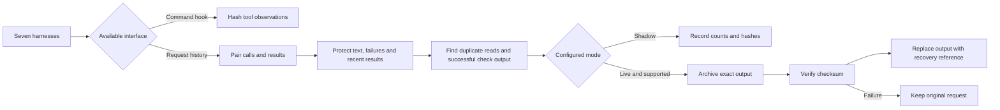
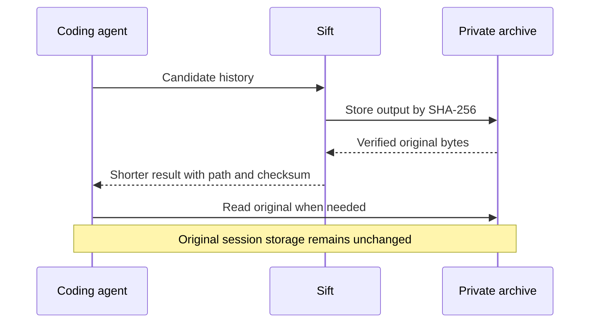

# Sift workflows

## Measure before promotion

## Recover exact evidence

## An ambiguous result

Keep the result. If a person needs help evaluating it, explicitly submit a bounded excerpt to an authorized reviewer through the `review` command. Advice is not a deletion decision. Installed hooks never call the reviewer automatically.

## Harness support

Native request pruning: OpenCode, Pi, Hermes. Command observers: Claude Code, Codex, Kimi, Gemini. All can use explicit export against supported message layouts. Do not describe exported JSON as live native compaction.
