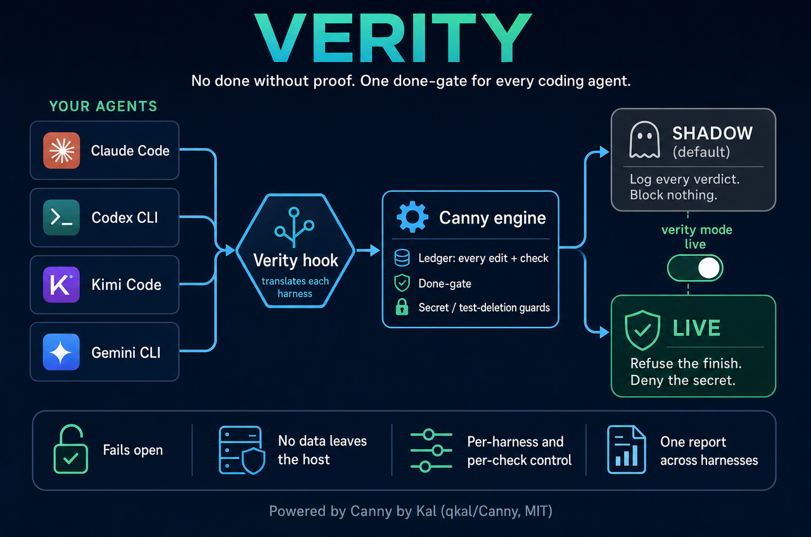

# Verity

**No done without proof. One done-gate for every coding agent.**



Coding agents say "done" before anything has been run. Verity stops that across four harnesses at once: Claude Code, Codex CLI, Kimi Code and Gemini CLI. Every edit and every check the agent runs is recorded. When the agent tries to finish after changing code with no passing test, build, lint or type-check since, Verity can refuse the finish and tell the agent what's missing. It also catches secrets written into files, deleted or skipped tests, and piped test commands (`npm test | tail`) that hide a failure.

It installs in **shadow mode**: every verdict is logged and nothing is blocked. One command switches it to **live**, for all harnesses or one, and for all checks or only the ones you trust.

## Credit

The engine is **[Canny](https://github.com/qkal/Canny) by Kal ([@qkal](https://github.com/qkal))**, MIT licensed. Canny does the real work: the append-only ledger of edits and checks, the done-gate, and the secret, test-deletion and pipefail guards. Its design rule, "facts go to code, judgments go to a model, only facts can block", is why Verity can run with the model switched off entirely.

Verity adds what Canny doesn't ship: adapters for Kimi Code and Gemini CLI, a shadow wrapper, a shadow/live switch that can be scoped per harness and per check, one cross-harness report, and an installer that preserves your existing hooks. Canny is not vendored here. The installer clones it at a pinned commit (`f2c5e53`, v0.3.0), and its MIT license and copyright (© 2026 Kal) stay with that checkout. If Verity is useful to you, star Canny.

## How it works

1. **Your agent** fires a hook on session start, before and after each edit or shell command, and when it tries to finish.
2. **The Verity hook** (`scripts/verity-hook.sh <harness>`) receives the event. Kimi and Gemini events are translated into the shape Canny reads by `scripts/adapter.mjs`. Claude Code and Codex are native.
3. **Canny** updates its ledger and returns a verdict: allow, refuse the finish, deny or ask about a tool call, rewrite a command, or add a note.
4. **Verity** logs the verdict, then:
   - in **shadow**, answers `{}` so the agent is unaffected;
   - in **live**, returns the verdict in the harness's own format (translated back for Kimi and Gemini).

Canny's optional Jev model is disabled in both modes: the API key is stripped and the endpoint points at a dead port, so no text leaves the host. If anything fails (Canny missing, a timeout, malformed output), Verity answers `{}` and the agent carries on.

| Harness | Config written | Scope | Translation |
|---|---|---|---|
| Claude Code | `<project>/.claude/settings.json` | that project | native |
| Codex CLI | `<project>/.codex/hooks.json` | that project | native. Codex runs a new hook only after you approve it once with `/hooks` in an interactive session |
| Kimi Code | `~/.kimi-code/config.toml` | every Kimi session | `adapter.mjs kimi` / `--out kimi` |
| Gemini CLI | `~/.gemini/settings.json` | every Gemini session | `adapter.mjs gemini` / `--out gemini` |

OpenCode, Pi and Hermes are not supported: none has a hook that can refuse a finish.

## Install

Requires Node 22+, `jq`, `git` and bash. Canny has no dependencies and ships a built `dist/`.

```bash
bash scripts/install.sh --project /path/to/project                 # all four harnesses, shadow mode
bash scripts/install.sh --harness claude,gemini --project .         # a subset
bash scripts/install.sh --dry-run                                   # preview the changes
```

The installer clones Canny into `--canny-dir` (default `/home/workspace/Integrations/canny`) unless a checkout is already there, backs up every config file to `~/.verity/backups/` first, and adds one hook group per event. Existing hooks are kept, re-running changes nothing, and entries from the earlier `canny-shadow` name are repointed.

## Shadow and live

```bash
bash scripts/verity.sh status                                   # mode and checks, per harness
bash scripts/verity.sh mode live                                # enforce everything, everywhere
bash scripts/verity.sh mode live --harness claude               # enforce in Claude Code only
bash scripts/verity.sh mode live --checks deny                  # enforce only secret/test-deletion denies
bash scripts/verity.sh mode live --harness gemini --checks done,deny
bash scripts/verity.sh mode shadow                              # back to logging only
bash scripts/verity.sh reset [--harness kimi]                   # clear overrides
```

The setting is stored in `~/.verity/config.json` and read on every hook call, so a switch takes effect on the agent's next action without restarting anything. Precedence: `VERITY_MODE` / `VERITY_CHECKS` environment variables, then the per-harness setting, then the global setting, then shadow. `VERITY_DISABLE=1` turns Verity off in one process.

| Check | Canny verdict | Claude Code / Codex | Kimi Code | Gemini CLI |
|---|---|---|---|---|
| `done` | refuse the finish | block the stop; the agent continues | deny; reason sent back once | `AfterAgent` block; the agent continues |
| `deny` | block a tool call | deny | deny | deny |
| `ask` | confirm a tool call | ask (Claude), deny (Codex) | deny (no ask support) | ask |
| `rewrite` | add `pipefail` | rewritten command | message only (no rewrite support) | rewritten `tool_input` |
| `note` | context for the agent | `additionalContext` | message | `additionalContext` |
| `warn` | warning | `systemMessage` | message | `systemMessage` |

## Report

```bash
bash scripts/report.sh     # verdicts by harness and check, how many were applied, latency, crashes
```

| Path | Holds |
|---|---|
| `~/.canny/sessions/*.jsonl` | Canny's ledger: command lines, exit codes, edited paths. Command lines can contain secrets, so the directory is owner-only |
| `~/.verity/verdicts.jsonl` | Every non-empty verdict, with harness, mode, check, whether it was applied, and latency |
| `~/.verity/config.json` | The shadow/live setting |
| `~/.canny/errors.log` | Canny crashes (it fails open) |

Environment overrides: `CANNY_DIR`, `CANNY_CLI`, `CANNY_HOME`, `VERITY_HOME`, `VERITY_LOG`.

**Rollback:** `verity.sh mode shadow` stops enforcement immediately. To remove the hooks, copy each backup from `~/.verity/backups/` over its config file.

## Going live safely

1. Run in shadow for a week or two and read `report.sh`.
2. Check every would-be `done` block against the session. It's a false positive when the work was verified by something Canny doesn't count, such as `bun some.test.ts` or a curl smoke test. Add those as `verify` patterns in a trusted `.canny.json` before enforcing.
3. Every `deny` should be a real secret or a real test deletion. Enforce that check first: `verity.sh mode live --checks deny`.
4. Keep median latency under 250 ms per tool call, with no crashes.
5. Add `done` once its false positives are handled.

## Adapters

Kimi and Gemini input shapes were captured from live sessions (Kimi Code 0.41.0, Gemini CLI 0.58.0). Their output formats were read from the same installed versions.

- **Kimi** uses Claude-style event and tool names but calls the file argument `path`, returns `tool_output` as a string, and reports failures as a structured `error` whose message carries the exit code. It blocks only on `permissionDecision: "deny"` or exit code 2, and feeds a Stop block back to the model once.
- **Gemini** uses `BeforeTool`/`AfterTool`/`AfterAgent`, tools named `write_file`, `replace` and `run_shell_command`, and reports a command's exit code as `Exit Code: N` inside `llmContent`. It reads a top-level `decision` and `reason`, and rewrites through `hookSpecificOutput.tool_input`.

Kimi and Gemini ledgers are named `claude-kimi-<id>` / `claude-gemini-<id>` because Canny parses them as Claude events.

## Tests

```bash
bash test/run.sh
```

Hermetic: a fake Canny CLI and a temporary `HOME`, project and Verity home. Covers translation in both directions, shadow mode for every harness, the Jev key never reaching Canny, the kill switch, the mode CLI, live mode per harness and per check, environment precedence, failing open on bad output, and the installer's merge, preservation, migration and idempotency.
