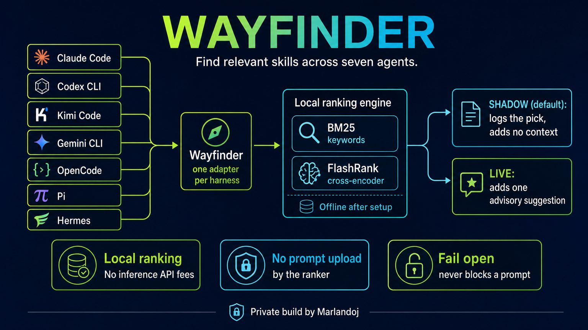
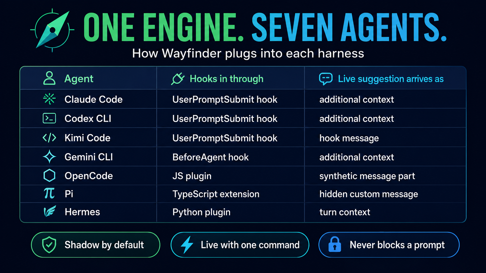

# Wayfinder

**Find relevant skills across seven coding agents.**

Wayfinder searches your installed `SKILL.md` catalog when you submit a prompt. One local ranking engine serves Claude Code, Codex CLI, Kimi Code, Gemini CLI, OpenCode, Pi and Hermes. Start in shadow mode to inspect suggestions; switch to live when you want the agent to see them.



## How it works

1. A native hook or lightweight plugin extracts the user prompt.
2. BM25 keyword scoring shortlists up to 20 skill descriptions.
3. FlashRank reranks the shortlist with `ms-marco-MiniLM-L-12-v2`.
4. Shadow mode records the proposed skill locally. Live mode adds one advisory note with the skill's name, path and short description.
5. The agent decides whether to read the skill. Wayfinder never runs a skill, authorizes a tool or blocks a prompt.

No Jev, generative LLM or inference API is involved in ranking. The model is downloaded once during explicit setup. Prompt hooks use cached model files only, and fail open if they are missing. The agent itself still uses its configured model provider; any live suggestion becomes part of that agent's context.

## Seven harnesses, one engine



| Harness | Entry point | Live delivery | Configuration scope |
| --- | --- | --- | --- |
| Claude Code | `UserPromptSubmit` | `additionalContext` | Project `.claude/settings.json` |
| Codex CLI | `UserPromptSubmit` | `additionalContext` | Project `.codex/hooks.json`; interactive hook trust applies |
| Kimi Code | `UserPromptSubmit` | Hook `message`; accepts content-part prompts | User `~/.kimi-code/config.toml` |
| Gemini CLI | `BeforeAgent` | `additionalContext` | User `~/.gemini/settings.json` |
| OpenCode | `chat.message` plugin | Synthetic text part with session, message and part IDs | User `~/.config/opencode/plugin/wayfinder.js` |
| Pi | `before_agent_start` extension | Hidden custom message | User `~/.pi/agent/extensions/wayfinder.ts` |
| Hermes | `pre_llm_call` plugin | Current-turn user context | User `~/.hermes/plugins/wayfinder` and `plugins.enabled` |

Tested against installed versions dated September 23, 2026: Claude Code 2.1.280, Codex 0.156.x, Kimi 0.41.0, Gemini 0.58, OpenCode 1.18.29, Pi 0.85 and Hermes 0.16. Harness APIs may change. [Validation and current limitations](docs/validation.md) distinguish model responses from hook/request evidence.

## Install

Linux prerequisites: Python 3.11+, Bash, GNU `timeout`, `jq`; Node 22+ for the plugin tests. Install Python dependencies into the `python3` environment your harness inherits. A virtual environment must be on that harness's `PATH`.

```bash
git clone git@github.com:marlandoj/wayfinder.git
cd wayfinder
python3 -m pip install -r requirements.txt
python3 scripts/setup_model.py
bash scripts/install.sh --project /absolute/path/to/project --dry-run
bash scripts/install.sh --project /absolute/path/to/project
```

Use `--harness codex,kimi,gemini` to select a subset. The installer preserves unrelated hooks, backs up changed config files to `~/.wayfinder/backups`, and leaves existing mode choices intact. Repeating an unchanged installation creates no backup. It can migrate the earlier Claude-only `jev-skill-advisor` hook when Claude is selected.

On Codex, review and trust the new hook through `/hooks`. The installer does not write trust hashes or bypass trust. Restart running harnesses after installing plugins or changing hook configuration. Once loaded, mode changes take effect on the next prompt.

Plugins are linked to this checkout, so keep it at its installed location. For copied plugin files, set `WAYFINDER_HOOK` to the absolute hook path. When moving a checkout, remove its old hook entries/plugin links and reinstall from the new location.

### Your skill catalog

When installed at `Skills/wayfinder`, the default catalog is its sibling skills under `Skills/`. Other clone locations default to `~/.agents/skills`. To share any catalog across all harnesses, put these settings in the environment inherited by their launcher:

```bash
export WAYFINDER_SKILLS_ROOTS=/absolute/path/to/shared/skills:/absolute/path/to/other/skills
```

The first root wins on duplicate skill names. Discovery scans one and two directory levels for frontmatter `name` and `description`; hidden category directories beginning with `_` are excluded. `WAYFINDER_NATIVE_SKILLS=1` additionally includes each harness's native skill directories. That option changes the candidate set and should be evaluated before enabling broadly.

## Shadow → inspect → live

```bash
bash scripts/wayfinder.sh status
bash scripts/wayfinder.sh suggest "Generate a product poster image"
bash scripts/wayfinder.sh report
bash scripts/wayfinder.sh mode live --harness codex
bash scripts/wayfinder.sh mode live
bash scripts/wayfinder.sh mode shadow
bash scripts/wayfinder.sh off
bash scripts/wayfinder.sh on
```

A global mode command clears per-harness overrides. `off` is the immediate kill switch; `on` restores the configured modes. Live suggestions are advisory, including when a suggested skill conflicts with higher-priority instructions.

For one invocation only, set `WAYFINDER_MODE=live`. `WAYFINDER=0` disables the hook for that invocation. Persistent status reports the saved modes; invocation-specific environment overrides may differ.

## Practical workflows

- **Shared team catalog:** maintain skill descriptions once; each engineer's preferred harness uses the same ranker and catalog roots.
- **Measured rollout:** collect shadow suggestions, review false matches, improve descriptions, then enable live per harness.
- **Provider interruption:** switch the agent's provider while keeping local skill discovery and logs independent of inference APIs.

The workflow illustration is also available as [editable Mermaid text](docs/workflows.md).

## Runtime, privacy and limits

| Setting | Default | Purpose |
| --- | --- | --- |
| `WAYFINDER_HOME` | `~/.wayfinder` | Modes, disable sentinel, logs and backups |
| `FLASHRANK_CACHE_DIR` | `~/.cache/wayfinder` | Local model files; populated by setup |
| `WAYFINDER_TIMEOUT` | 4 seconds | Maximum synchronous live ranking time |
| `WAYFINDER_SHADOW_TIMEOUT` | 15 seconds | Maximum detached shadow worker time |
| `WAYFINDER_HOOK` | Resolved from plugin checkout | Hook override for copied plugins |
| `WAYFINDER_ENGINE` | Bundled `engine/run.py` | Test/custom engine override; trusted code only |

Shadow hooks return immediately and start a bounded background process. The harness or operating system can terminate that worker, so a missing shadow row is not proof that a prompt never happened. Live mode waits for ranking, then fails open on errors or timeouts.

`suggestions.jsonl` stores a prompt SHA-256, length, session ID, working directory, selected skill, candidate scores and duration. It does not store raw prompt text. Directory and new log permissions are owner-only. Paths and skill names can still be sensitive; keep logs private. Harness-native logs may contain original prompts independently of Wayfinder.

Only the first 2,000 prompt characters are ranked. Prompts shorter than eight characters and slash commands are skipped. Skill descriptions are limited to 500 characters during ranking. Scores express relative relevance, not calibrated confidence. Broad or meta-level prompts can select an irrelevant skill; this is why shadow is the default.

The earlier 56-case diagnostic measured 0.86 top-choice accuracy on each author-written half using the predecessor catalog. It is not an independent benchmark of today's catalog. Its roughly 110 ms warm ranking time excludes interpreter/model startup. Recent real process measurements were roughly 0.6–1.4 seconds; inspect your own log and do not treat these as a latency guarantee.

## Validate and roll back

```bash
bash test/run.sh
python3 test/regression.py
```

The shell suite covers seven adapter outputs, mode changes, timeouts, failure handling, installer preservation/idempotence and real local ranking. Regression tests exercise an installation path containing spaces and prevent missing-cache network downloads. See [validation](docs/validation.md) for the separate Pi TypeScript check and live evidence.

For immediate rollback, run `bash scripts/wayfinder.sh off`. To uninstall, remove only Wayfinder hook entries and plugin links, and remove `wayfinder` from Hermes `plugins.enabled`. Restore a full backup only if no later unrelated config changes would be lost. This repository does not install a scheduled service or require Jev credentials.

## Credits

Wayfinder is built by Marlandoj from the local skill advisor and the multi-harness installation patterns developed for Verity.

- [FlashRank](https://github.com/PrithivirajDamodaran/FlashRank), by Prithivi Da and contributors, supplies the local cross-encoder runtime (Apache 2.0). FlashRank and its downloaded model retain their own licenses; neither is vendored in this repo.
- [hermes-jev-skills](https://github.com/kerpopule/hermes-jev-skills) inspired the investigation into prompt-time skill selection. Wayfinder uses local BM25 and FlashRank in place of Jev.
- [Canny](https://github.com/qkal/Canny), by Kal (@qkal), powers the separate Verity project and informed the earlier shadow rollout. Canny is not a Wayfinder dependency.

The workflow images are AI-generated marketing illustrations, not screenshots or certification by the named harness vendors. This is a private repository; third-party dependencies retain their respective licenses.
