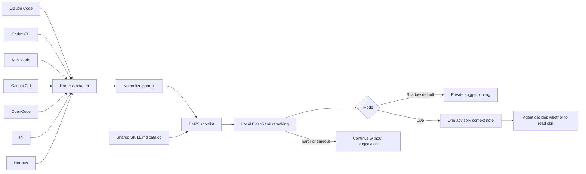
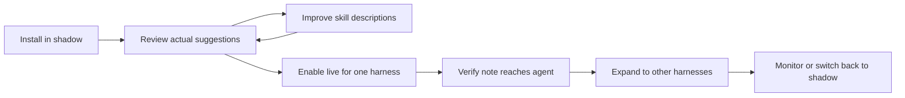

# Wayfinder workflows

Setup may download the ranking model. Prompt-time ranking cannot download it. Live context is consumed by the harness and its configured provider; Wayfinder itself makes no remote ranking request.
